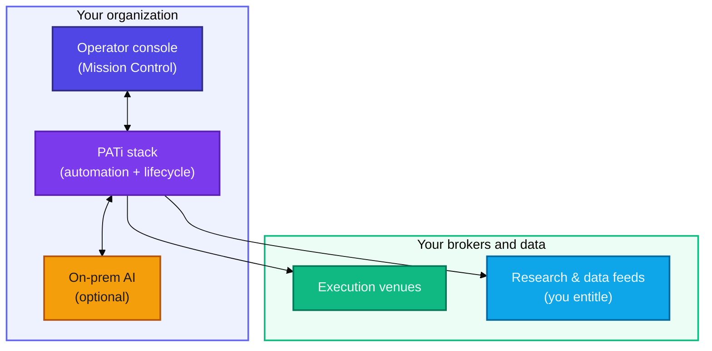
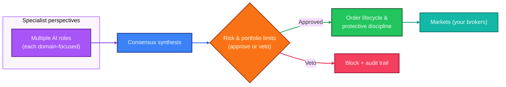
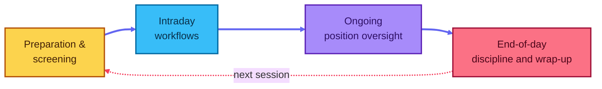
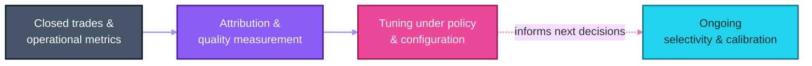
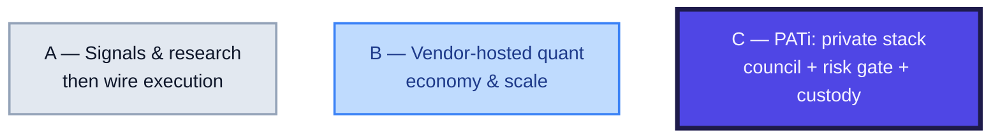

# PATi — Private Algorithmic Trading (international)

**Shared Oxygen, LLC**

---

## Executive summary

**PATi** (Private Algorithmic Trading) is a **self-hosted** algorithmic trading platform: strategy logic, learning signals, and operator workflows run on **your infrastructure**—so sensitive research, agent behavior, and trade history are not a SaaS product’s dataset. The product pairs a **Mission Control** operator console with an **end-to-end operating rhythm** from premarket preparation through intraday management and end-of-day discipline, designed for **equities, options, and crypto** in a **single** configurable stack.

PATi is built around a **council of specialized AI roles** (not a single “do-everything” model). Multiple perspectives feed a **consensus** decision, while a **Risk** function can **veto** proposals that fail portfolio constraints—governance that mirrors how professional desks separate idea generation from risk approval.

PATi does **not** promise returns. It is positioned for operators who want **discipline, auditability, and continuous improvement** under their own control.

---

## Visual summary

At-a-glance relationship maps: how custody, decisions, the trading day, and learning reinforce each other.

### Figure 1 — Custody: your control plane

**Takeaway:** you retain governance of research, prompts, and trade history—on your side of the boundary. **Brokers, data, and terms are yours to configure.**

### Figure 2 — Governance: specialists, consensus, risk gate

**Takeaway:** idea generation and **permission to proceed** are separate—like a professional desk, not a single opaque score.

### Figure 3 — Operating cadence (typical market day)

**Takeaway:** automation is a **day cycle**, not a one-off backtest or alert script.

### Figure 4 — Learning loop

**Takeaway:** selectivity and clarity tighten as evidence accumulates, within policies you set.

### Figure 5 — How teams often automate

*A, B, and C are different build-or-buy patterns—**not** steps in one workflow.*

PATi is the third: **operator custody** and a **governed** end-to-end stack—in one self-hosted product, not a chain of point tools.

---

## The problem PATi addresses

Most trading failures are operational: the gap between backtests and live markets, weak execution hygiene, and systems that cannot explain *why* a trade was taken or blocked. Single-model approaches often collapse many domains (technicals, sentiment, derivatives structure, events, and portfolio risk) into one abstraction—raising both blind spots and fragility when regimes change.

PATi’s design thesis is that **trading is multi-domain work**, and that robust automation should look like a **governed process**: specialists contribute evidence, a consensus synthesizes, risk can say “no,” and outcomes feed a **closed-loop** improvement cycle.

---

## What makes PATi distinctive

| Theme | What it means for an operator |
| --- | --- |
| **Privacy & control** | Run on premises; use **your** data subscriptions and **your** execution relationships. Core intelligence can use **local** large-language model inference, avoiding dependency on a cloud model vendor for the core stack. |
| **Specialist council + governance** | Multiple AI roles (strategy, technicals, sentiment, options, exits, macro, events, anomaly detection, and post-trade learning) feed a **consensus**; **Risk** can **veto**—hard separation of “idea” vs “permission.” |
| **Autonomous operations** | Scheduled workflows from **premarket** through **intraday** activity, **position lifecycle management**, and **end-of-day** processes—an operating cadence, not a one-off script. |
| **Cross-asset, one platform** | A unified operator experience and automation fabric across **equities, options, and crypto** with **broker-agnostic** integration (configurable; primary institutional-grade connectivity where supported by your brokers). |
| **Capital-protection discipline (NLWTIAL)** | “Never Let a Winner Turn Into a Loser” is **policy**, not a slogan: structured progression from protection at entry through breakeven and trailing behavior, with **MFE/MAE**-style position analytics to support defensible risk management. |
| **Global session readiness (optional)** | When enabled, a **multi-market** scheduler coordinates regional workflows and keeps market-scoped state coherent—relevant to operators who want one control plane across regions, not a patchwork of scripts. |
| **Transparency** | Decisions, vetoes, and execution attempts are intended to be **auditable** so leadership can answer “what happened, and why” with evidence—not folklore. |
| **Self-improvement** | Outcomes are fed back to calibrate selectivity, weights, and confidence over time, under configuration control—tighten when evidence says tighten. |

---

## Who PATi is for

- **Systematic trading leaders** who need repeatable automation with governance.
- **Security- and IP-sensitive** teams who will not cede **strategy, prompts, and transaction metadata** to a multi-tenant cloud.
- **Operators** who value **exits, risk, and process** as the durable edge—not ad hoc alpha rumors.
- **Builders** who want a full platform to extend, not a closed black box.

---

## Market context: what PATi is built to lead

Competing and adjacent tools are named **only to anchor categories** in the footnotes; the point is not to catalogue their roadmaps, but to state what PATi **is architected to combine** in one **operator-run** system—each row is a **product commitment** (see “What makes PATi distinctive” above and your deployment configuration), not a performance promise.

| Where PATi is purpose-built | What PATi delivers (product fact) | What is usually elsewhere in the market |
| --- | --- | --- |
| **Custody of IP and data** | Runs on **your** infrastructure; your strategy, prompts, and operating history are not a shared SaaS dataset by design. | Many stacks centralize **research, execution, or charting in vendor or broker** environments. |
| **Governed machine intelligence** | A **council of specialist roles** with **consensus** and a **separate Risk veto**—explicit separation of “generate ideas” vs “permit risk.” | Typical automation is a **single model, single “bot,”** or **research tool without portfolio veto gating** in the same product. |
| **End-to-day operating system** | **Scheduled** workflows from premarket through intraday, **position lifecycle**, and **end-of-day** discipline in **one** stack. | The market is full of **strong point solutions** (charts, backtests, APIs) that still leave **stitching and ops** to the team. |
| **Cross-asset, one operator plane** | **Equities, options, and crypto** through **configurable** broker relationships in a **unified** Mission Control. | Teams often run **separate** tools or **regional** stacks per asset class. |
| **Enforced loss-avoidance discipline (NLWTIAL)** | “Never Let a Winner Turn Into a Loser” is a **stated** operating doctrine with **staged** protective action—not an optional add-on. | **Exit discipline** is often left to discretion or a separate system. |
| **Optional global session awareness** | **Multi-market** scheduling and **market-scoped** state when you turn it on—**one** control model for more than one region. | **Regional** or **separate** schedulers are the common default. |
| **Audit and learning under policy** | Decisions, vetoes, and execution attempts are intended to be **auditable**; outcomes feed **calibration** under **your** config policy. | **Provenance and tuning** are often **fragmented** across notebooks, logs, and ad hoc scripts. |

A **broker** (e.g. [IBKR](https://www.interactivebrokers.com/en/trading/ib-api.php), [Alpaca](https://alpaca.markets/)) is a **counterparty and connection**, not a substitute for a full **governance, council, and workflow** product—PATi sits **above** the wire you select.

**Irrefutability standard:** the left column is **architectural intent**; the middle column matches **PATi’s public product description** in this material. The right column is a **broad** industry pattern (not a review of a single vendor) and is **not** a feature matrix.

### References (categories only)

- **Hosted quant + open engine** — [QuantConnect](https://www.quantconnect.com/) · [LEAN](https://www.lean.io/)  
- **Widely distributed retail (FX/CFD class) platform family** — [MetaTrader 5 — algorithmic trading](https://www.metatrader5.com/en/automated-trading)  
- **Futures- / NinjaScript-centered platform** — [NinjaTrader](https://ninjatrader.com/trading-platform/)  
- **Charting + Pine (strategy mode per vendor help)** — [TradingView — autotrade & Pine](https://www.tradingview.com/support/solutions/43000481026-how-to-autotrade-using-pine-script-strategies/)  
- **US API-first broker (example class)** — [Alpaca](https://alpaca.markets/)  
- **Global multi-asset broker + APIs (venue class)** — [IBKR API](https://www.interactivebrokers.com/en/trading/ib-api.php)

---

## Disclosures

Algorithmic systems can connect to **live markets**. All trading involves risk of loss. Past or simulated performance does not guarantee future results. Operators remain responsible for **regulatory compliance**, **suitability**, **market data entitlements**, and **broker terms** in their jurisdictions. This document is **not** investment advice.

---

**Shared Oxygen, LLC** · **PATi** — Private Algorithmic Trading
